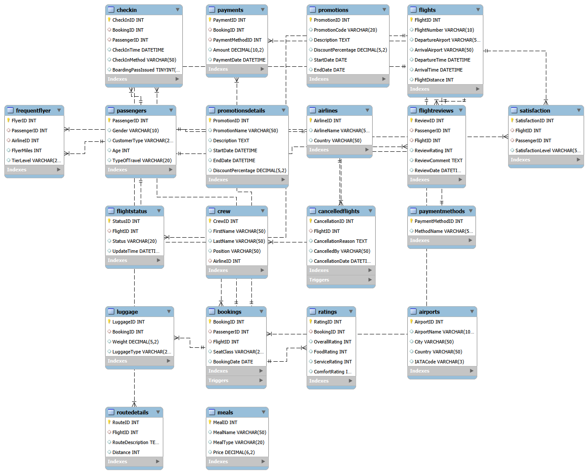

# Airline Database Management System

## Project Overview

This project is a MySQL based Airline Database Management System designed to manage airline operations, passenger records, bookings, payments, cancellations, baggage tracking, customer reviews, and operational analytics.

The system uses relational database design principles along with advanced SQL queries, stored procedures, functions, and triggers to automate airline business operations and maintain data integrity.

---

## Objectives

- Centralize airline operational data
- Improve reservation and booking workflows
- Automate business rules using SQL triggers
- Support customer satisfaction and operational analytics
- Enhance data reliability and reporting efficiency

---

## Features

- 20 normalized relational database tables
- Advanced SQL joins and analytical queries
- Stored procedures for reporting and automation
- SQL functions for loyalty and operational calculations
- Triggers for business rule enforcement
- Passenger satisfaction analytics
- Flight booking and cancellation management
- Frequent flyer and promotions management
- ER diagram modeling using MySQL Workbench

---

## Tech Stack

- MySQL
- SQL
- MySQL Workbench
- Relational Database Design
- Stored Procedures
- Functions
- Triggers

---

## Key Functionalities

### Analytics Queries
- Customer satisfaction analysis
- Flight delay impact analysis
- Frequent flyer behavior tracking
- Route popularity analysis
- Service rating analysis

### Stored Procedures
- Generate satisfaction reports
- Retrieve passenger booking history
- Identify customer complaints and feedback trends

### Triggers
- Prevent booking on cancelled flights
- Prevent duplicate passenger reviews
- Automatically update customer loyalty categories

---

## Database Components

- Passengers
- Flights
- Bookings
- Airlines
- Airports
- FlightStatus
- Crew
- Luggage
- Ratings
- Promotions
- Payments
- Satisfaction
- FrequentFlyer
- CancelledFlights
- RouteDetails
- FlightReviews
- CheckIn

---

## ER Diagram

---

## Project Files

- SQL Script File
- ER Diagram
- Portfolio Project Report
- Query Execution Results
- MySQL Workbench Screenshots

---

## Portfolio Report

[View Full Project Report](Airline Database System Project Report.pdf)

---

## SQL Script

[View SQL Script](AirlineDatabaseSystem (1).sql)

---

## Author

Sai Nischala Kuchibhotla
